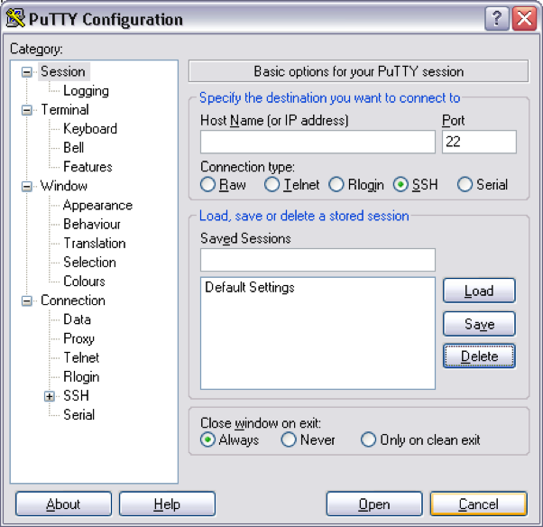
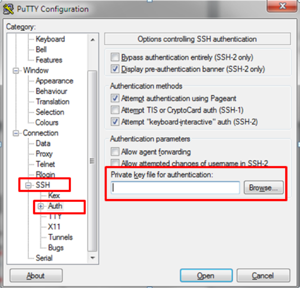

# Lab Setup 
## MacOS 
Download `lab.pem` from the `keys` directory

### Set permission on SSH key 
```
chmod 600 /path/to/lab.pem
```

### SSH to lab servers 
The username for SSH is `ubuntu`
```
ssh -i /path/to/lab.pem ubuntu@<LAB IP> 
```


## Windows 
Download `lab.ppk` from `keys` directory

Open Putty and configure a new session. 
  


Expand “Connection_SSH_Auth and then specify the PPK file 


 Now save your session    


