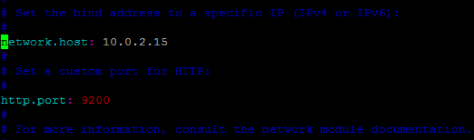

# Elastic Stack Lab01
In this lab we will be installing and setting up an Ubuntu VM using VirtualBox.  After we have the VM running we will log in and install ElasticSearch. 

## Download and install VirtualBox 
VirtualBox is an application that allows you to run VMs on your local machine.  Download it from https://www.virtualbox.org/wiki/Downloads

After downloading VirtualBox continue to the Windows or Mac section below 

### Windows 
Installing VirtualBox on Windows is straight forward and only takes a few steps which are outlined below. 

Run the executable by double clicking on it, and you’ll see a window like below: 


Click “Next” to begin the installation.  During the installation you’ll receive a network warning like below.  This just means you will be disconnected from the network for a second. 


Go ahead and click “Yes” to continue the installation 


Click Install and you’ll see a screen confirming you trust Oracle, and want to install Universal Serial Bus device.  Click “Install” to continue the installation. 


Now continue the wizard until installation is complete. 

### Mac 
To install VirtualBox on MacOS double-click the DMG file downloaded in the previous step to open it and you’ll see the following: 


Follow the instructions and double-click the `Virtualbox.pkg` file to start the installation wizard. 

Click “Continue” in the pop-up window and then again to start the installation.  At this point you may seen an error saying it couldn’t install VirtualBox and to open Security preferences on your Mac.  Click this button, click the lock in the bottom left corner, type in password, and then click “Allow”.  


Rerun the installation and it should succeed. 

  

## Install Ubuntu 
Now we are going to install a popular Linux distribution Ubuntu 16.04. 
Download Ubuntu server 16.04 from https://www.ubuntu.com/download/server

In VirtualBox click “New” and in the pop-up give your VM a name, for Type choose Linux, and for Version select Ubuntu (64-bit)


Click “Continue” and on the next screen give your VM as much memory as you can spare. The minimum is 2GB, and recommended is 4GB. 


Click “Continue” , and then “Create” to create a virtual hard disk (VDI)  and then Continue to create a Dynamically allocated disk.  Set the size of disk to 20GB or more.

At this point you are dropped back to the main VirtualBox window, click the “Start” button and you will be prompted for an ISO image, click the little folder icon to browse to the Ubuntu ISO downloaded earlier. 


Now you’ll go through the Ubuntu installation process.  Select language (Default is English), then “Install Ubuntu Server” , after this select the defaults until it begins the installation.  

Fill in a hostname


Provide full name, username and password then hit Enter.  Now continue the installation by choosing defaults. 
After choosing LVM for filesystem select “Yes” to write changes by hitting the TAB key and then Enter. 


Confirm size of disk and hit Enter.  Now click TAB again and then Enter to confirm partition is written.  Select defaults until it asks what software to install, scroll to the bottom and hit spacebar to select SSH server, then hit Enter to install Ubuntu. 

When installation is complete hit Enter on this screen to reboot.


Now we just need to configure some port forwarding to make it easy to access Elasticsearch from our local machine. 

In VirtualBox click Settings —> Network —> Advanced —> Port Forwarding. 


In the Port Forwarding screen click the little green icon with a plus sign in the top right and add the following rules, replacing `GuestIP` with the IP of your VM.


Now SSH to your VM either using terminal or Putty, with the following information. 

```
Host: 127.0.0.1
Port: 2222
```

Once you confirm SSH works continue on with the next section to install Elasticsearch. 

## Install Elasticsearch 
Now that Ubuntu is installed let’s login and install Elasticsearch.

### Mac
SSH to Ubuntu VM 
```bash
ssh ubuntu@127.0.0.1 -p2222 
```


### Windows 
Open Putty and configure a new session.   
**CHANGE PORT to 2222**


 Now save your session 


Elasticsearch is based on Java, so we need to install a Java environment.
```bash
sudo apt-get install default-jdk
```

Now we can install Elasticsearch itself.

First let’s add the Elasticsearch GPG key to our VM
```bash
wget -qO - https://artifacts.elastic.co/GPG-KEY-elasticsearch | sudo apt-key add -
```

Now we need to add the Elasticsearch repo to our VM. 
```bash
sudo apt-get install apt-transport-https
echo "deb https://artifacts.elastic.co/packages/6.x/apt stable main" | sudo tee -a /etc/apt/sources.list.d/elastic-6.x.list
```

Finally let’s install Elasticsearch
```bash
sudo apt-get update && sudo apt-get install elasticsearch
```

After this completes we need to allow external access to our Elasticsearch instance. 


Find out the IP address of your VM. 
```
ifconfig 
```

You will see something like the following 


Note down the IP address (example 10.0.2.15)

Edit `elasticsearch.yml` 
```bash
sudo vi /etc/elasticsearch/elasticsearch.yml
```

Change `network.host` to <IP address from step above>




 (in vi, use the arrow keys to move where you want to edit, then hit “i” to enter “insert mode” and make your edits. When done, hit ESC to exit “insert mode”, then type :wq to write your changes and quit vi.)

Now we have to restart the daemon so it re-reads the updated configuration file. 
```bash
sudo /bin/systemctl daemon-reload
sudo /bin/systemctl enable elasticsearch.service
sudo /bin/systemctl start elasticsearch.service
```

If everything restarted without any errors Elasticsearch has been successfully installed! 

Let’s confirm it is working as expected by connecting to the API.
```bash
curl 127.0.0.1:9200
```

```bash
$ curl 127.0.0.1:9200
{
  "name" : "itdyml7",
  "cluster_name" : "elasticsearch",
  "cluster_uuid" : "lRpAt5psT1Cr-u6hS_bc2Q",
  "version" : {
    "number" : "6.2.3",
    "build_hash" : "c59ff00",
    "build_date" : "2018-03-13T10:06:29.741383Z",
    "build_snapshot" : false,
    "lucene_version" : "7.2.1",
    "minimum_wire_compatibility_version" : "5.6.0",
    "minimum_index_compatibility_version" : "5.0.0"
  },
  "tagline" : "You Know, for Search"
}
```

You can also test it by loading http://127.0.0.1:9200 in a browser, and if you see something like the following it’s working correctly. 


## Loading data into Elasticsearch 
Now that we have Elasticsearch installed it needs some data to aggregate and index.  Let’s go ahead and load in the complete works of William Shakespeare 

Download and create the mapping 
```bash
wget http://bit.ly/es-shakes-mapping -O shakes-mapping.json
curl -H 'Content-Type: application/json' -XPUT 127.0.0.1:9200/shakespeare --data-binary @shakes-mapping.json
```

Download the data 
```bash
wget http://bit.ly/es-shakes-data -O shakespeare_6.0.json
```

Now we are going to load this data into Elasticsearch through it’s API
```bash
curl -H 'Content-Type: application/json' -X POST 'localhost:9200/shakespeare/doc/_bulk?pretty' --data-binary  @shakespeare_6.0.json
```

And finally let’s go ahead and search the data we just inserted. 
```bash
curl -H 'Content-Type: application/json' -XGET '127.0.0.1:9200/shakespeare/_search?pretty' -d '
{
"query" : {
"match_phrase" : {
"text_entry" : "to be or not to be"
}
}
}
'
```

We are searching all of the data we inserted for “to be or not to be” and our result is…   Wow, pulled it out very quickly and we now know that it came from Hamlet.
```json
{
  "took" : 153,
  "timed_out" : false,
  "_shards" : {
    "total" : 5,
    "successful" : 5,
    "skipped" : 0,
    "failed" : 0
  },
  "hits" : {
    "total" : 1,
    "max_score" : 13.874454,
    "hits" : [
      {
        "_index" : "shakespeare",
        "_type" : "doc",
        "_id" : "34229",
        "_score" : 13.874454,
        "_source" : {
          "type" : "line",
          "line_id" : 34230,
          "play_name" : "Hamlet",
          "speech_number" : 19,
          "line_number" : "3.1.64",
          "speaker" : "HAMLET",
          "text_entry" : "To be, or not to be: that is the question:"
        }
      }
    ]
  }
}

```

## Lab Complete