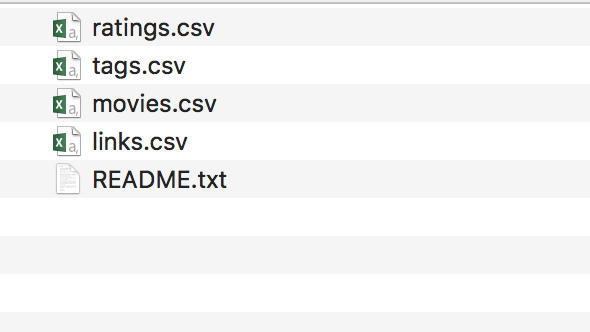

# Elastic Stack Lab02
In this lab we are going to add some additional data to our `Elasticsearch` cluster. This will allow us to see how it interacts with different types of data. 

## Movielens Dataset 
First we need to download the Movielens dataset that we are going to import into Elasticsearch. To do this open the following URL in your browser. 
https://grouplens.org/datasets/movielens/

Now we are going to download the smaller dataset under “recommended for education and development”. We do not have the computing power with one VM to crunch through the larger datasets. 

Click “ml-latest-small.zip” to download it to your local machine and then double click to unzip.  Now we can see there are quite a few files inside of the zip folder. 

If you want to learn more about the project and the data you can open `README.txt` .  We are going to poke around and see what is in each of these files. 

Open up ratings.csv and you’ll see, the `userId` of the person who rated it, `movieId`, the `rating` and the `timestamp` of when it was rated. 

If you scroll to the bottom you’ll notice that there are `100005` rows of data in here!  That’s a lot of data to go through and index, but that’s what Elasticsearch was built for! 

Now that you’ve looked at the ratings data you’re probably curious what the `movieId` correlates to.  Let’s open up `movies.csv` and see. 

We can see there’s over 9000 rows in this file and one thing you’ll notice is the release date is not it’s own column, it is combined with the movie title so we’re going to have to do some magic so that we can query based on release year as well as the other fields. 

There’s a couple more files in here and they all get imported so we can sort based on different types an fields of data. 
Go ahead and open up `links.csv` and `tags.csv` and look around. 

## Lab Complete
